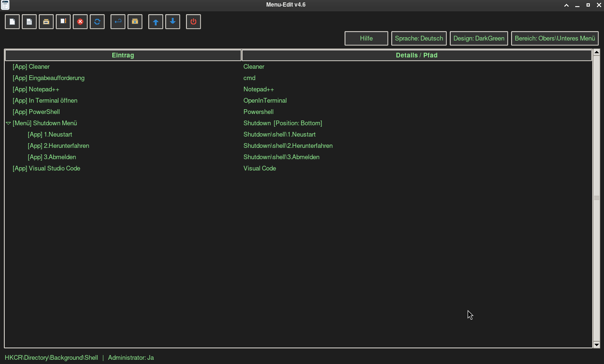
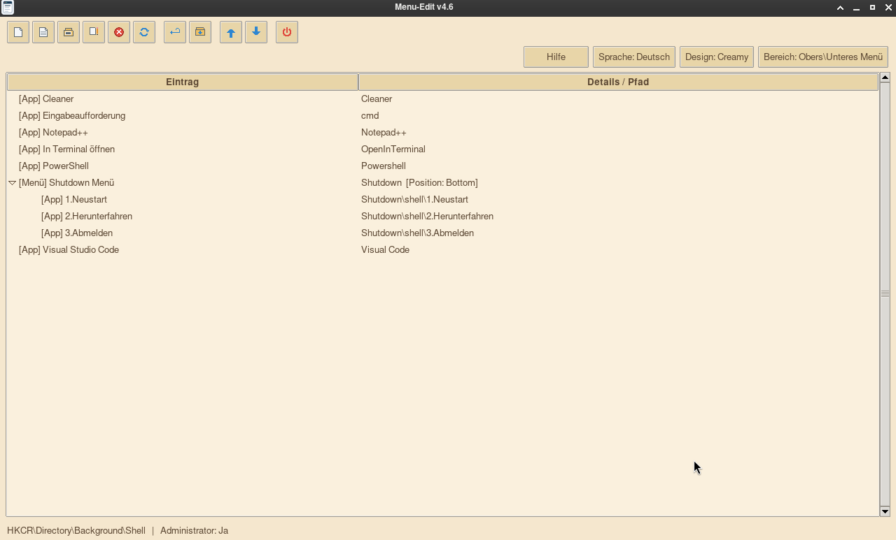
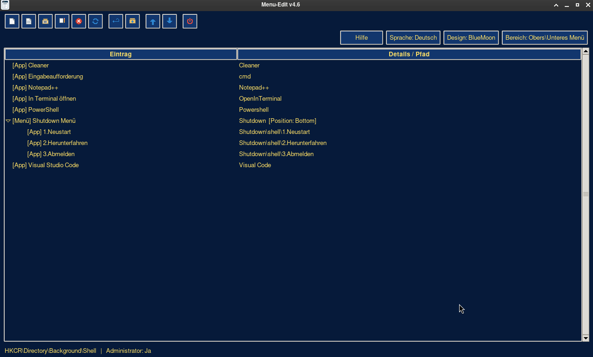

<div align="center">


**Menu-Edit** — edit the Windows desktop context menu (Registry) · Das Windows-Desktop-Kontextmenü bearbeiten (Registry)

`Python 3.11+` · `Tkinter (Stdlib)` · `Windows 10/11` · `GPL-3.0` · 🇩🇪 / 🇬🇧

</div>

---

<div align="center">

</div>

| | | |
|---|---|---|
|  |  | |

> **Hinweis zu den Screenshots:** Das Tool zeigt auch **Icons** an — die Toolbar-Buttons haben eigene Icons, und im Baum wird vor jedem Eintrag das in der Registry hinterlegte Icon angezeigt (z. B. das Icon der Anwendung hinter dem Kontextmenü-Eintrag). Auf den Aufnahmen oben sind die Eintrags-Icons nicht zu sehen, weil sie in einer Testumgebung unter Linux ohne Windows-Icon-Extraktion entstanden sind — unter Windows erscheinen die Icons wie beschrieben.
>
> **Note on the screenshots:** The tool also displays **icons** — the toolbar buttons have their own icons, and the tree shows the icon stored in the registry in front of each entry (e.g. the application icon behind the context-menu entry). The screenshots above were taken in a test environment under Linux without Windows icon extraction, so the entry icons are not visible there — on Windows the icons appear as described.

---

# 🇩🇪 Deutsch

**Menu-Edit** ist ein Python-Tool zum Bearbeiten des Windows-Desktop-Kontextmenüs über die Registry — mit grafischer Oberfläche, Backup-Schutz und Undo. Verwaltete Bereiche:

- `HKEY_CLASSES_ROOT\Directory\Background\Shell` (Desktop-Hintergrund)
- `HKEY_CLASSES_ROOT\DesktopBackground\Shell`

## Funktionen

- **Einträge & Menüs erstellen, bearbeiten, löschen** — einfache Befehls-Einträge und verschachtelte Kaskaden-Menüs (`SubCommands`-Struktur) unter den oben genannten Shell-Schlüsseln.
- **Positionierung `Top` / `Mitte` / `Bottom`** — „Mitte" ist die Standard-Vorauswahl in allen Anlegen-Dialogen; das Shutdown-Menü bleibt immer unten.
- **Verschieben per Pfeil-Buttons oder Drag & Drop** — mit sichtbarem Einfüge-Balken zwischen den Zeilen (obere Zeilenhälfte = davor, untere = danach einfügen; untere Menü-Hälfte = in das Menü hinein) und Auto-Scroll am Listenrand. Der anvisierte Eintrag selbst wird nie verschoben.
- **Mehrfachauswahl** — mehrere Einträge per Strg/Shift markieren und als Block mit den Pfeil-Buttons oder per Drag & Drop verschieben (Markierungsreihenfolge bleibt erhalten).
- **An Windows-Einträgen vorbeisortieren** — an schreibgeschützten System-Einträgen (`cmd`, `PowerShell`, …, TrustedInstaller-Besitz) wird automatisch vorbeisortiert, ohne sie anzufassen; der sichtbare Name bleibt erhalten.
- **Feste Windows-Einträge löschen** — mit Bestätigungsdialog und automatischem `.reg`-Backup im Dokumente-Ordner (Wiederherstellung durch Ausführen der Datei).
- **Rückgängig-Funktion** — die letzten 10 Änderungen werden einzeln rückgängig gemacht (nur im Speicher, nach Neustart leer).
- **Shutdown-Menü per Ein-Klick** — legt idempotent ein Menü *Shutdown Menü* mit *Neustart / Herunterfahren / Abmelden* an; vorhandene Befehle werden nie überschrieben.
- **Icon-Vorschau** — der Baum zeigt die in der Registry hinterlegten Icons der Einträge (in den Screenshots oben nicht sichtbar, siehe Hinweis dort).
- **Backup als `.reg`** — aktueller Bereich, beide separat oder kombiniert; Backup-Pfad frei wählbar und persistiert. Beim ersten Start gibt es einen Backup-Hinweis.
- **Rechtsklick-Kontextmenü** — alle Toolbar-Funktionen an der Mausposition.
- **Hilfe-Dialog** — erklärt alle Funktionen, in den Farben des gewählten Designs.
- **Zweisprachig** — Deutsch (Standard) und English, live umschaltbar über den Button *Sprache*.
- **Drei Designs** — Creamy, DarkGreen (Standard) und BlueMoon, per Durchschalt-Button.
- **Eingebettete, lizenzfreie Icons** — alle Toolbar-Icons sind originale, selbst gezeichnete Pixel-Grafiken (`icons/*.png`, regenerierbar mit `make_icons.py`); das Projekt-Icon (Titelleiste/Taskleiste/EXE) stammt aus `icons/menu-editor.svg` (`make_app_icon.py`).
- **Explorer-Benachrichtigung** — die Shell wird nach Änderungen automatisch aktualisiert.

## Setup & Start

```cmd
git clone https://github.com/cvinz78/Menu-Edit.git
cd Menu-Edit

python -m venv venv
venv\Scripts\activate
pip install -r requirements.txt   :: derzeit leer – reine Python-Stdlib

python Menu-Edit.py
```

- Nur unter **Windows** ausführbar (`winreg` + Shell-APIs).
- Das Programm **startet immer mit Administrator-Rechten**: Die EXE fordert per Manifest die UAC-Abfrage an (`--uac-admin`), das Script startet sich ohne Rechte per UAC neu. Lehnt man die UAC-Abfrage ab, läuft es eingeschränkt weiter (Warnung in der Statusleiste).
- Einstellungen liegen unter `%USERPROFILE%\.config\menu-editor\settings.ini` (Design, Bereich, Fenstergröße, Sprache, Backup-Pfad).

## Build als EXE

`build.bat` (cmd) bzw. `build.ps1` (PowerShell) baut `Menu-Edit.py` als **eine einzelne windowed-EXE**:

```cmd
build.bat
```
```powershell
powershell -NoProfile -ExecutionPolicy Bypass -File build.ps1
```

- Eigenes Build-venv in `venv-build\` (wird angelegt und wiederverwendet, die globale Python-Umgebung bleibt unberührt); PyInstaller wird dort automatisch installiert.
- Ergebnis: `dist\Menu-Edit.exe` (One-File, windowed, mit EXE-Icon und eingebettetem `icons\`-Ordner) sowie `dist\sha.txt` (SHA-256, Dateiname, Erstellungszeitpunkt).
- Idempotent, prüfbarer Exitcode (0 = Erfolg, 1 = Fehler).

## Projektstruktur

| Datei/Ordner | Zweck |
|---|---|
| `Menu-Edit.py` | Komplette Anwendung (Single-File) |
| `build.bat` / `build.ps1` | EXE-Build (PyInstaller, eigenes venv) |
| `icons/` | Toolbar-Icons, Projekt-Icon (.ico/.png/.svg) |
| `make_icons.py` | Erzeugt die Toolbar-Icons neu (`python make_icons.py`) |
| `make_app_icon.py` | Rendert das Projekt-Icon aus der SVG |
| `docs/` | Banner + Screenshots |
| `LICENSE` | GPL-3.0 |

## Lizenz

Dieses Projekt steht unter der **GNU General Public License v3.0** — siehe [LICENSE](LICENSE).

---

# 🇬🇧 English

**Menu-Edit** is a Python tool for editing the Windows desktop context menu through the registry — with a graphical interface, backup protection and undo. Managed areas:

- `HKEY_CLASSES_ROOT\Directory\Background\Shell` (desktop background)
- `HKEY_CLASSES_ROOT\DesktopBackground\Shell`

## Features

- **Create, edit and delete entries & menus** — simple command entries and nested cascading menus (`SubCommands` structure) under the shell keys listed above.
- **Positioning `Top` / `Center` / `Bottom`** — "Center" is the default in all create dialogs; the shutdown menu is always placed at the bottom.
- **Move via arrow buttons or drag & drop** — with a visible insertion bar between rows (upper half of a row = insert before, lower half = insert after; lower half of a menu = insert into it) and auto-scroll at the list edges. The target entry itself is never moved.
- **Multi-selection** — mark several entries with Ctrl/Shift and move them as a block with the arrow buttons or via drag & drop (selection order is preserved).
- **Sort past Windows entries** — read-only system entries (`cmd`, `PowerShell`, …, TrustedInstaller-owned) are bypassed automatically without touching them; the visible name is preserved.
- **Delete fixed Windows entries** — with a confirmation dialog and an automatic `.reg` backup in the Documents folder (restore by running the file).
- **Undo** — the last 10 changes can be undone one by one (in memory only, cleared on restart).
- **One-click shutdown menu** — idempotently creates a *Shutdown Menü* containing *Restart / Shut down / Log off*; existing commands are never overwritten.
- **Icon preview** — the tree shows the icons stored in the registry for each entry (not visible in the screenshots above, see the note there).
- **Backup as `.reg`** — current area, both areas separately, or combined; backup path is configurable and persisted. A backup hint is shown on first start.
- **Right-click context menu** — all toolbar functions at the mouse position.
- **Help dialog** — explains every feature, colored according to the active theme.
- **Bilingual** — German (default) and English, switchable live via the *Sprache/Language* button.
- **Three themes** — Creamy, DarkGreen (default) and BlueMoon, cycled via a button.
- **Embedded, license-free icons** — all toolbar icons are original, hand-drawn pixel graphics (`icons/*.png`, regenerate with `make_icons.py`); the project icon (title bar/taskbar/EXE) comes from `icons/menu-editor.svg` (`make_app_icon.py`).
- **Explorer notification** — the shell is refreshed automatically after changes.

## Setup & Usage

```cmd
git clone https://github.com/cvinz78/Menu-Edit.git
cd Menu-Edit

python -m venv venv
venv\Scripts\activate
pip install -r requirements.txt   :: currently empty – pure Python stdlib

python Menu-Edit.py
```

- **Windows only** (`winreg` + Shell APIs).
- The program **always starts with administrator rights**: the EXE requests elevation via its manifest (`--uac-admin`), the script relaunches itself via UAC. If UAC is declined, it continues with limited functionality (warning in the status bar).
- Settings are stored in `%USERPROFILE%\.config\menu-editor\settings.ini` (theme, area, window size, language, backup path).

## Build as EXE

`build.bat` (cmd) or `build.ps1` (PowerShell) builds `Menu-Edit.py` into a **single windowed EXE**:

```cmd
build.bat
```
```powershell
powershell -NoProfile -ExecutionPolicy Bypass -File build.ps1
```

- Uses a dedicated build venv in `venv-build\` (created and reused; the global Python environment stays untouched); PyInstaller is installed there automatically.
- Result: `dist\Menu-Edit.exe` (one-file, windowed, with EXE icon and embedded `icons\` folder) plus `dist\sha.txt` (SHA-256, file name, build time).
- Idempotent, with a verifiable exit code (0 = success, 1 = failure).

## Project structure

| File/Folder | Purpose |
|---|---|
| `Menu-Edit.py` | Complete application (single file) |
| `build.bat` / `build.ps1` | EXE build (PyInstaller, dedicated venv) |
| `icons/` | Toolbar icons, project icon (.ico/.png/.svg) |
| `make_icons.py` | Regenerates the toolbar icons (`python make_icons.py`) |
| `make_app_icon.py` | Renders the project icon from the SVG |
| `docs/` | Banner + screenshots |
| `LICENSE` | GPL-3.0 |

## License

This project is licensed under the **GNU General Public License v3.0** — see [LICENSE](LICENSE).
